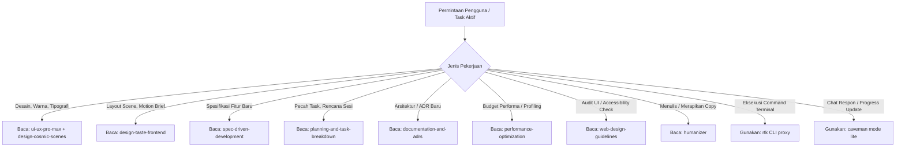

# Perutean Skill & Resolusi Konflik — XEVRYN Cosmic Portfolio

Versi: 1.0 · Tanggal: 21 September 2026 · Status: Disetujui

Dokumen ini mendefinisikan aturan pemanggilan skill (*skill routing*), matriks pembagian tanggung jawab, penanganan pemicu tugas (*triggers*), serta protokol resolusi konflik instruksi antara aturan umum skill eksternal dan brief visual kosmik XEVRYN.

---

## 1. Matriks Pembagian Tanggung Jawab (Division of Responsibilities)

Untuk mencegah tumpang tindih perintah, setiap domain pekerjaan dialokasikan ke spesialisnya masing-masing:

| Domain Pekerjaan | Penanggung Jawab Utama | Rekan Kerja / Sinergi | Output / Artefak yang Dihasilkan |
|---|---|---|---|
| **Sistem Desain & Panduan UX** | `ui-ux-pro-max` | `design-cosmic-scenes` | Skema token warna, tipografi, skala spasi 8px, pola navigasi, dan panduan micro-interaction |
| **Komposisi Visual & Koreografi Motion** | `design-taste-frontend` (`taste-skill`) | `choreograph-cosmic-scroll`, `build-cosmic-webgl` | Ritme tata letak (asimetris, bento), hierarki scene, kurva easing, dan intensitas gerak kosmik |
| **Spesifikasi Teknis & Persyaratan** | `spec-driven-development` (Addy Osmani) | `plan-cosmic-portfolio` | Spesifikasi formal fitur, pemetaan kapabilitas modul, dan validasi prasyarat |
| **Dekomposisi Task & Dependensi** | `planning-and-task-breakdown` (Addy Osmani) | `plan-cosmic-portfolio` | Pembagian unit tugas implementasi, kriteria acceptance eksplisit, dan urutan dependensi |
| **Dokumentasi Keputusan Arsitektur** | `documentation-and-adrs` (Addy Osmani) | `structure-cosmic-app` | Berkas catatan arsitektur di `docs/19-decisions.md` (ADR) dengan trade-off dan konsekuensi |
| **Metodologi Profiling & Budget Performa** | `performance-optimization` (Addy Osmani) | `optimize-cosmic-performance` | Kerangka pengukuran LCP/CLS/INP, GPU draw calls budget, strategi bottleneck fix (tanpa hasil fiktif) |
| **Audit Antarmuka & Aksesibilitas** | `web-design-guidelines` (Vercel Labs) | `adapt-cosmic-accessibility`, `verify-cosmic-experience` | Checklist kepatuhan WCAG 2.1 AA, rasio kontras, target sentuh (44px), keyboard focus trap |
| **Penyempurnaan Naskah & Prose** | `humanizer` | `docs/07-content.md` | Prose bio, narasi studi kasus, CTA teks bebas klise AI tanpa mengubah angka, ID, kode, atau fakta |
| **Ringkasan Komunikasi Agen** | `caveman` (mode lite) | Percakapan interaktif | Komunikasi terarah dan efisien antara agen dan pengguna dalam bahasa Indonesia yang singkat dan jelas |
| **Optimasi Output Terminal Shell** | `rtk` (CLI Proxy) | Eksekusi powershell | Keluaran konsol yang ringkas tanpa boilerplate, menjaga exit code dan rincian error yang relevan |

---

## 2. Aturan Perutean Berdasarkan Pemicu Tugas (Trigger Mapping)

Agen hanya membaca berkas `SKILL.md` yang relevan dengan tugas aktif untuk menghemat token dan menjaga fokus:

---

## 3. Resolusi Konflik: Brief Kosmik vs Aturan Estetika Generik

Skill eksternal memiliki aturan bawaan yang ditujukan untuk website komersial umum. Pada konteks **XEVRYN Cosmic Portfolio**, aturan-aturan umum tersebut wajib diinterpretasikan dengan memprioritaskan brief kosmik:

### A. Palet Warna & Efek Nebula (Lila / Purple Gradient Rule)
- **Aturan Generik Taste Skill:** Membatasi warna ungu neon dan gradient glow karena sering menjadi klise AI default (*The Lila Rule*).
- **Resolusi Brief XEVRYN:** Tema XEVRYN secara eksplisit adalah **alam semesta kosmik (deep space void `#05050A`, nebula magenta `#C084FC`, interstellar cyan `#38BDF8`, star gold `#FCD34D`)**. Penggunaan nebula glow dan gradien kosmik **diperbolehkan dan wajib**, namun harus dieksekusi dengan harmonisasi terkalibrasi (tidak asal memancarkan glow pada setiap tombol).

### B. Intensitas Motion & Dial Project
- **Konfigurasi Dial Terpilih:**
  - `DESIGN_VARIANCE: 8` (Asimetris terarah, layout sinematik)
  - `MOTION_INTENSITY: 9` (Sinematik, perpindahan kamera 3D, parallax partikel)
  - `VISUAL_DENSITY: 3` (Spacious, bernapas, fokus pada karya)
- **Resolusi Ketenangan Konten (*Calm Zones*):** Meskipun `MOTION_INTENSITY` bernilai 9, saat pengguna masuk ke area membaca (About bio, daftar proyek, rincian keahlian), visual kosmik harus mereda menjadi latar belakang tenang (*ambient drift*) agar keterbacaan teks 100% terjaga.

### C. Reduced Motion & Aksesibilitas
- **Aturan Non-Negotiable:** Preferensi sistem `prefers-reduced-motion: reduce` dan tombol toggle Reduced Motion di UI **mengalahkan seluruh dial motion**. Saat aktif, seluruh warp streak, rotasi konstan, parallax, dan perpindahan kamera 3D dimatikan.

### D. Integritas Konten vs Humanizer
- **Aturan Humanizer:** Merapikan kalimat yang terdengar kaku atau sarat klise AI.
- **Batasan Ketat Proyek:** `humanizer` **DILARANG KERAS** memodifikasi:
  - ID requirement (`REQ-01` s/d `REQ-12`)
  - ID animasi (`ANM-001` s/d `ANM-064`)
  - ID task (`TSK-001` s/d `TSK-060`)
  - Path berkas, perintah terminal, kode TypeScript/CSS, atau atribut konfigurasi.
  - Fakta teknis, tanggal rilis, atau status konten (`CONTENT_PENDING`).

### E. Output Ringkas vs Akurasi Teknis (Caveman & RTK)
- **Komunikasi Pengguna:** Gunakan gaya `caveman` (mode lite) untuk pesan status chat: padat, lugas, dalam bahasa Indonesia yang baik, tanpa pengulangan formalitas basi.
- **Dokumentasi Resmi Proyek:** Semua berkas Markdown (`docs/*.md`, PRD, Task, Storyboard, ADR) **wajib ditulis secara komprehensif, terstruktur, dan lengkap**. Prinsip pemadatan kata Caveman **tidak boleh diterapkan** pada dokumen repositori.
- **Terminal:** `rtk` menyaring teks output tanpa menghilangkan rincian kegagalan build/test atau exit code. Jika diperlukan tracing mendalam, agen dapat melihat log mentah.
